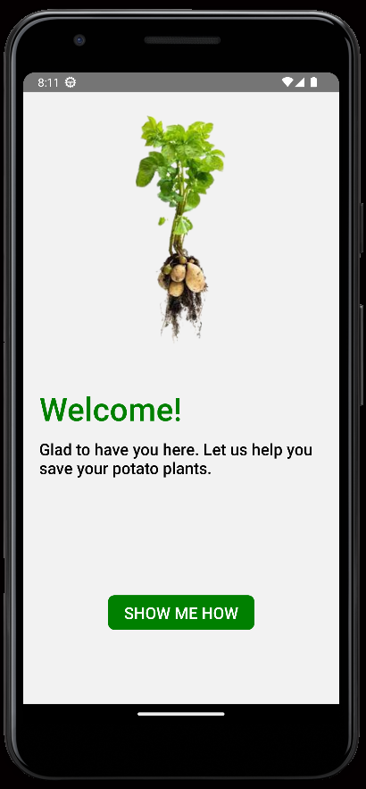
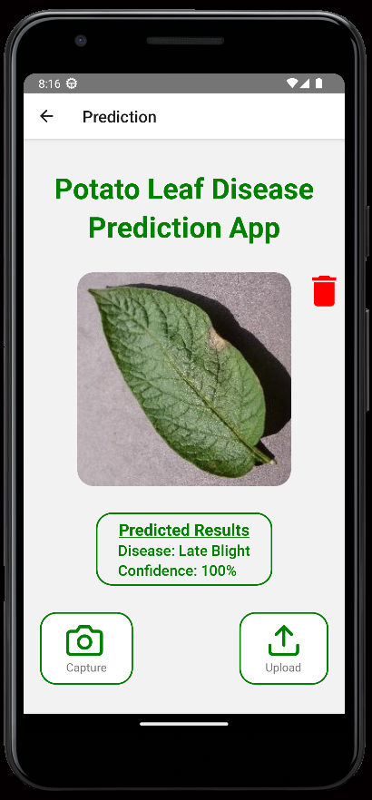

# Potato leaf disease detection and identification using CNN

## Project Details
- Dataset - Obtained from Kaggle(PlantVillage Dataset)
- Model - Python, Jupyter Notebook
- Server - FastAPI
- Server Deployment - AWS EC2 Instance
- Mobile App - React Native

## Mobile app UI

### 1. Splash screen

------------------------------------------------------------

### 2. Instructions screen

------------------------------------------------------------

### 3. Prediction lab

------------------------------------------------------------

### 4. Uploaded image preview

------------------------------------------------------------

### 5. Results
